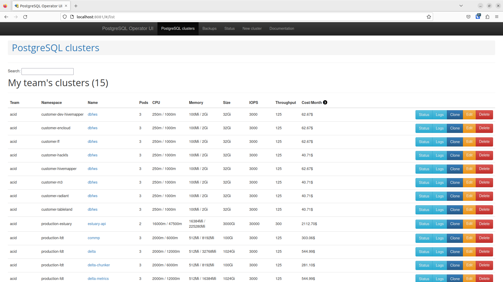

# Databases

## PostgreSQL on Kubernetes (Phosphophyllite)
We have various PostgreSQL clusters hosted on Phos k8s, including the most important one - `estuary-api`. Here's how to examine and manage them.

### Listing PostgreSQL clusters
Once you have `kubectl` [configured and set up for access to `phosphophyllite`](http://localhost:8000/admin/kubernetes/#getting-kubectl-access), you can access the Postgres Operator UI using kubectl port forwarding. This will give you a view of all PostgreSQL clusters running in Phosphophyllite, as well as the ability to spawn new PostgreSQL clusters if needed.

You can read [the quickstart guide for Postgres Operator](https://github.com/zalando/postgres-operator/blob/master/docs/quickstart.md#deploy-the-operator-ui) for more information, but what you probably want is the following one liner:

* `kubectl port-forward svc/postgres-operator-ui 8081:80 -n postgres`

Run that in a terminal (`screen` or `tmux` if you need it to run for a while) and in your favourite browser, navigate to [http://localhost:8081](http://localhost:8081) to open Postgres Operator UI.



!!! warning "Here be dragons..."
    Postgres Operator UI will allow you to do lots of potential harm to customer and core PostgreSQL clusters in very short order with very little warning. Please be careful and try to know what you're doing - if you are not sure - ask!

You will see all the PostgreSQL clusters we operate. You can click Status to check on the status of that particular cluster, Logs to view logs related to that cluster from the perspective of the Postgres Operator (as opposed to the service itself), Clone to create a new cluster from the latest available daily backup, Edit to edit the cluster or Delete to attempt to delete it.

!!! tip "When 'Delete' doesn't mean Delete..."
    Note that deleting a PostgreSQL cluster is not as easy as clicking that handy "Delete" button. There are delete protections in place that prevent accidental deletions of PostgreSQL clusters, as well as backups that will (eventually) need to be purged when deleting a cluster. For more, see "Deleting clusters" down below.

### Accessing databases - how do I access a database cluster on Kubernetes to check on its status?

* Open Rancher
* Go to the namespace containing the cluster you want to check on.
* Find one of the database pods (such as `dbfws-0`) for the database cluster in question, click the three dots (⋮) and click `> Execute Shell` to get a shell inside the container.
* Run `patronictl list` and check that all replicas are on the same timeline (TL) and have no `Lag in MB.`

### Accessing databases - how do I use a database within a database cluster?
Access to databases requires `sslmode=prefer` or `sslmode=on`. `sslmode=disable` is not supported.

* Inside Kubernetes: You can access the database using the hostname `servicename.namespace` - such as `dbfws.hivemapper` - or just `servicename` if you are inside the same namespace as that service. Use the standard PostgreSQL port (5432) unless told otherwise.
* Outside Kubernetes: To access a database outside Kubernetes, we use **MetalLB** to expose a normal private IP address that can be accessed outside of Kubernetes.

In order to access a database outside of Kubernetes, you will need the following settings in the `spec`:
```
spec:
  allowedSourceRanges:
    - 10.24.0.0/16 # FDI main private IP space
    - 10.42.0.0/16 # Internal Kubernetes private IP space
  enableMasterLoadBalancer: true
```

### Deleting a PostgreSQL cluster
From time to time you may want or need to delete a database cluster. This may be as a result of a customer leaving or being terminated, or a cluster simply no longer being needed by either the customer or our team.

!!! danger "Tread carefully!"
    Deleting a PostgreSQL cluster is an irreversible action. Make sure you either have tested and working backups before you proceed, or are 100% sure you do not need the data.

In order to delete a cluster, you must *annotate* the PostgreSQL CR with two annotations `delete-date` and `delete-clustername`. You can do this either through the Postgres Operator UI or through Rancher.

Create an annotation called `delete-date` with the date in YYYY-MM-DD format, and an annotation called `delete-clustername` with the exact name of the cluster as defined in the CR.

!!! tip "CPI is a special case"
    CPI-deployed PostgreSQL clusters must first be "orphaned" via removal from `values.yaml` before they can be deleted in this way, and `dbfws` clusters (the default cluster included for each customer) CANNOT be deleted in this way at all. This is not exactly an intentional choice - Helm does not allow for outside modifications to its resources and will overwrite any changes you make to resources it manages. Thus, your annotations will be overwritten before they take effect.

Once you have applied the annotations, you may delete the PostgreSQL cluster using any normal means (via Rancher, using `kubectl` or using the Operator UI).

Deleting clusters does not cleanup or remove their backups. Note that you may cause undesired behaviour (restore from backup) if you create a new cluster with the same exact name and namespace as a previous cluster that was not cleaned up.

## PostgreSQL VM clusters
There are two main PostgreSQL clusters operating outside of Kubernetes. These are powered by a combination of `etcd`, `patroni`, `postgresql` and `haproxy`.

### List of clusters

* Estuary Hosted Infrastructure (prod-ehi): prod-ehi-db[01:03].estuary.tech
* Estuary Bootstrap Infrastructure (prod-ebi): prod-ebi-db[01:03].estuary.tech

### Estuary Hosted Infrastructure (EHI) DB
The EHI database cluster runs database services for the following:

* EstuaryV2: Delta, Delta DM, Edge-UR, Edge-URID
* EstuaryV1: Shuttle 12, Edge Carriers,
* Gitea

### Estuary Bootstrap Infrastructure (EBI) DB
The EBI database cluster runs database services for the following:

* AWX automation
* Metal as a Service (MAAS) machine deployment
* Nautobot