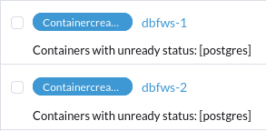
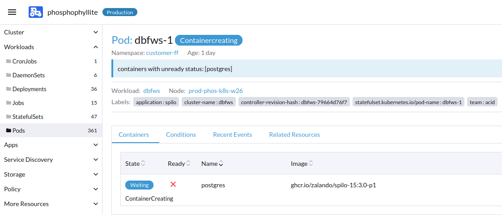
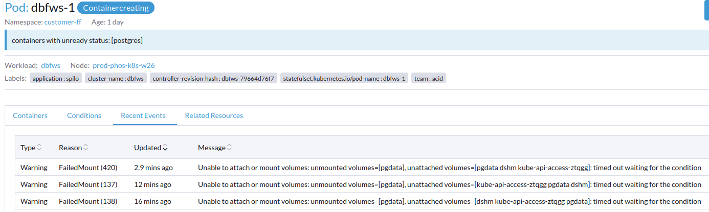
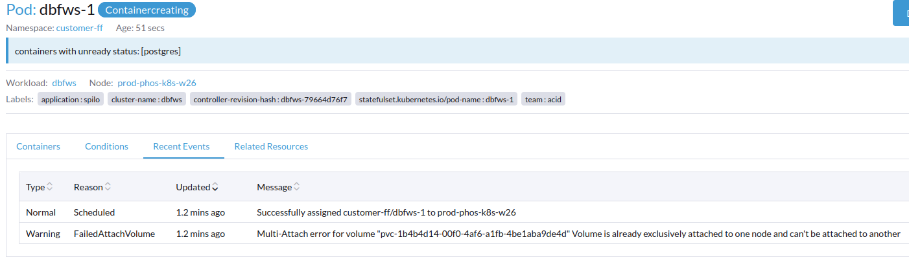

# Fixing stuck Rook volumes
For reasons unknown, occasionally Rook will get confused and leave a PersistentVolume falsely mounted on a node. This will cause issues the next time a pod is supposed to be scheduled that uses that PersistentVolume.

You can check for containers affected by this by going to Workloads -> Pods while "All Namespaces" is selected in the namespace selector (at the top right of Rancher).

They will look like this - blue or red in a pending or Containercreating state, that never changes.



Here is a picture of an affected pod:



## Finding the affected PersistentVolume
If you're lucky (as there is sometimes a bug that prevents this from displaying in Rancher), you will be able to select "Recent Events" and be told which PersistentVolume is preventing the pod from successfully starting.

This is not the case in this screenshot, where none of the needed information is displayed:


You can sometimes cause the name of the PersistentVolume to display by deleting and recreating the pod in question. You can do so by selecting the pod and clicking `Delete` - a Kubernetes operator such as ArgoCD will take care of respawning the pod (unless it's a one-time deployment)

If after restarting the pod, you cannot view its information, use `kubectl describe` on the pod in question. Here's an example with the pod that was pictured earlier:

`$ kubectl describe pod dbfws-1 -n customer-ff`

You're looking for the `events` down the bottom, kind of like this:

```
Events:
  Type     Reason              Age   From                     Message
  ----     ------              ----  ----                     -------
  Normal   Scheduled           2m7s  default-scheduler        Successfully assigned customer-ff/dbfws-1 to prod-phos-k8s-w26
  Warning  FailedAttachVolume  2m7s  attachdetach-controller  Multi-Attach error for volume "pvc-1b4b4d14-00f0-4af6-a1fb-4be1aba9de4d" Volume is already exclusively attached to one node and can't be attached to another
  Warning  FailedMount         4s    kubelet                  Unable to attach or mount volumes: unmounted volumes=[pgdata], unattached volumes=[pgdata dshm kube-api-access-749bz]: timed out waiting for the condition
```

This is what shows up when you've found the volume name successfully:


We've identified now that the volume's ID starts with 1b4b4d14, which we can use to find where the PV is attached and un-attach it.

## Finding the associated VolumeAttachment
In Rancher, go to `More Resources -> Storage -> VolumeAttachments` and open it.

Search for the volume's ID on the right, in this case "1b4b4d14".


Here we can see that the volume is attached on node `prod-phos-k8s-wxl02` in this case. Take a note of which node your volume is attached to.

Leave this open as a tab for later.

## Opening a shell on the affected node
In a new tab, go back to `Workloads -> Pods` and clear any filters you have set on namespaces or in the `Filter` box.

Search for the name of your node using the `Filter` box to view only pods running on that node.

Look for `csi-rbdplugin-SOMESTRING`, then using the three dots select "> Execute Shell" for that pod.

In the dropdown in the bottom left, select `csi-rbdplugin` to get a shell into the right container.

## Finding which device ID the volume is mounted as
Once in the shell, run `df` and grep for the name of the volume's ID as determined earlier:

```
[root@prod-phos-k8s-wxl02 /]# df | grep 1b4b4d14
/dev/rbd6        32716560     264488   32435688   1% /var/lib/kubelet/plugins/kubernetes.io/csi/pv/pvc-1b4b4d14-00f0-4af6-a1fb-4be1aba9de4d/globalmount/0001-0012-rook-ceph-external-0000000000000008-68514ead-c3b0-4cc0-baa6-56428107ab61
```

There should be only one device that is mounted at that path, and it should be a `/dev/rbd` device. Take note of the number involved and proceed.

## Cleaning up the resource
Now, roughly at the same time, go back to your tab from earlier with the VolumeAttachment. Delete the volumeattachment, and then in the `csi-rbdplugin` shell, type the following, using the name of the device as found in `df` (`/dev/rbd6 in this example`)

```
[root@prod-phos-k8s-wxl02 /]# rbd unmap -o force /dev/rbd6
```

Finally, delete the original pod that was having issues and let it naturally re-create.

