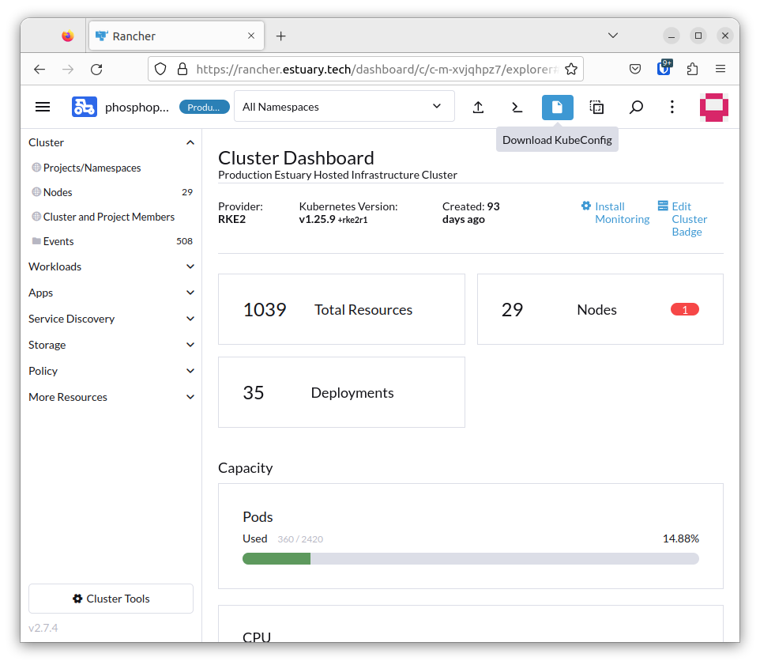

# Kubernetes and CPI
We have two Kubernetes clusters in FDI. There is the "parent" cluster, EBI (Estuary Bootstrap Infrastructure), and the "child" cluster, Phosphophyllite ("phos").

## Logging into Kubernetes
Logging into Kubernetes involves getting an authorisation token and authenticating against the Kubernetes API. The easiest way to do this is using Rancher, which is our Kubernetes management tool of choice.

Head to https://rancher.estuary.tech and sign in using the credentials found [here](https://start.1password.com/open/i?a=4XNRW7JPXZEI7C7CEIAF27VTSQ&h=my.1password.com&i=2twcybeqpcnjwr4roy6oacvfra&v=ki4skn3vacuvcqz3bcw532weou).

Once you've signed into Rancher, select the cluster you want to administrate by clicking the hamburger menu (☰) in the top left, then clicking the name of the cluster (`ebi` or `phosphophyllite`). You can now browse and administer the cluster or download KubeConfig files.

## Getting Kubectl access
Log onto Rancher, select the Kubernetes cluster you want to manage and click "Download KubeConfig".

Move the file to `~/.kube` (creating that folder if it doesn't exist), rename it to just `config`, and make sure it has appropriate permissions - only you should be able to read and write to that folder and the files within it.

## Managing Customer Provisioned Infrastructure
CPI is the short name for the overall goal of building, maintaining and managing infrastructure on behalf of FDT's customers.

It is powered by:

* Helm charts, packaged at https://github.com/application-research/fws-cpi-helm + developed in repos

### managing customers

### creating new customers

### editing existing customers

### Chart development and changes

## More details
### Rook.io Ceph integration

### ArgoCD configuration

### CPI Reporter

### The CPI Automaton

